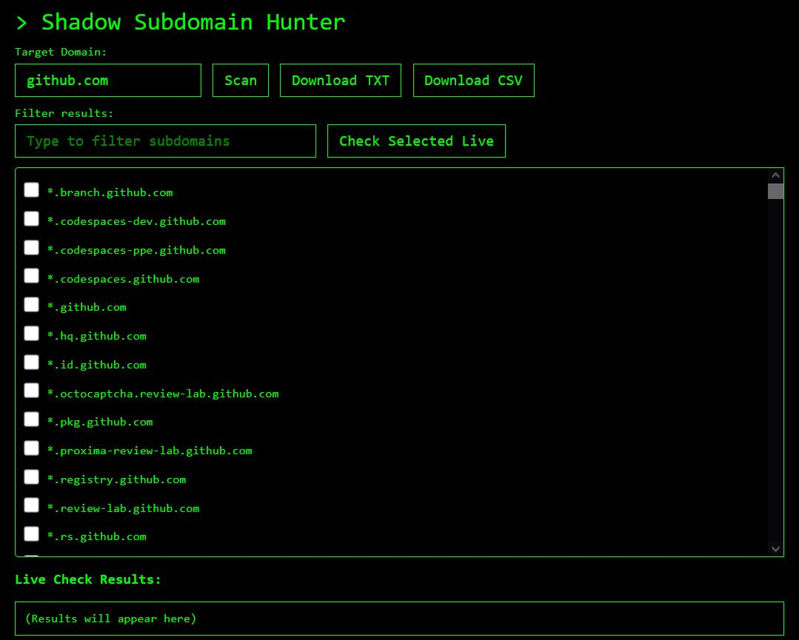

# Shadow Subdomain Hunter

**Shadow Subdomain Hunter** is a lightweight, browser-based tool for discovering subdomains of a target domain by aggregating data from multiple public sources. It also offers live checking of discovered subdomains to verify their accessibility.

## Features

- Aggregates subdomains from crt.sh, HackerTarget, ThreatCrowd, and Anubis APIs.
- Real-time display of found subdomains with checkboxes for selection.
- Filter functionality to quickly search within discovered subdomains.
- Live check feature to test if selected subdomains respond on HTTP/HTTPS.
- Export results to TXT or CSV files.
- Clean, hacker-style green-on-black UI with responsive design.

## Usage

1. **Enter Target Domain**: Input the domain you want to scan (e.g., `example.com`).
2. **Click Scan**: The tool will query multiple sources in parallel and display unique subdomains.
3. **Filter Results**: Use the filter input to narrow down subdomains.
4. **Select Subdomains**: Tick the checkboxes next to subdomains you want to check live.
5. **Check Selected Live**: Click the button to test accessibility of the selected subdomains.
6. **Download Results**: Export all found subdomains as TXT or CSV.

## How It Works

- The tool queries multiple public APIs to gather subdomains related to the target domain.
- Results are merged into a unique, sorted list.
- The live check feature sends HTTP and HTTPS fetch requests to selected subdomains to determine if they respond within a 5-second timeout.
- The UI updates dynamically to show progress and results.

## Screenshot

## Limitations

- Live check relies on client-side fetch with `no-cors` mode, which may not detect all live subdomains due to CORS and network restrictions.
- Dependent on the availability and reliability of external APIs.
- Designed for quick reconnaissance; not a replacement for more advanced subdomain enumeration tools.

## Requirements

- Modern web browser with JavaScript enabled.
- Internet connection to access public APIs.

## License

This project is provided as-is under the MIT License.